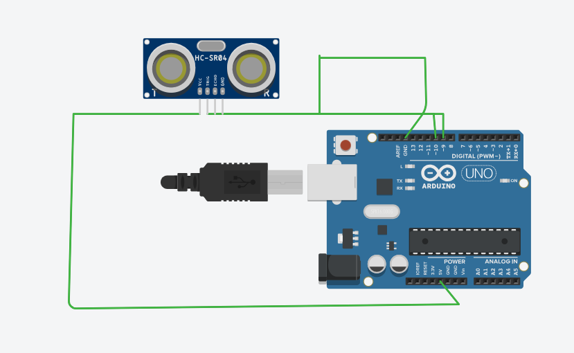

const int trigPin = 9;
const int echoPin = 10;

long duration;
int distance;

void setup() {
  pinMode(trigPin, OUTPUT);
  pinMode(echoPin, INPUT);
  Serial.begin(9600);
}

void loop() {
  digitalWrite(trigPin, LOW);
  delayMicroseconds(2);

  digitalWrite(trigPin, HIGH);
  delayMicroseconds(10);
  digitalWrite(trigPin, LOW);

  duration = pulseIn(echoPin, HIGH);

  distance = duration * 0.034 / 2;

  Serial.print("Distance: ");
  Serial.println(distance);

  delay(500);
}

